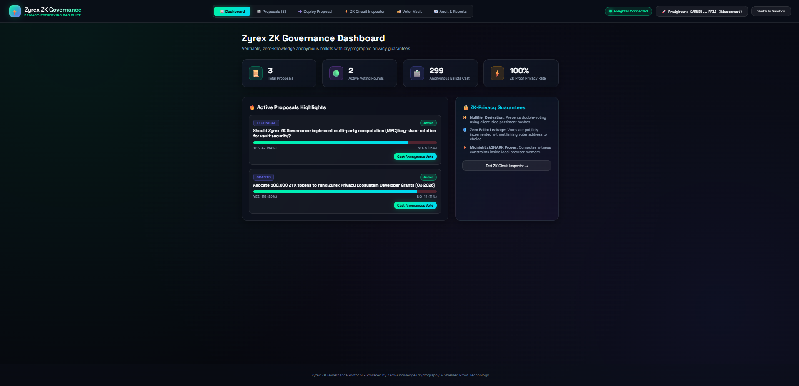
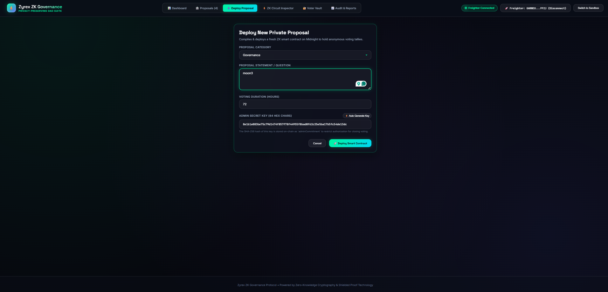
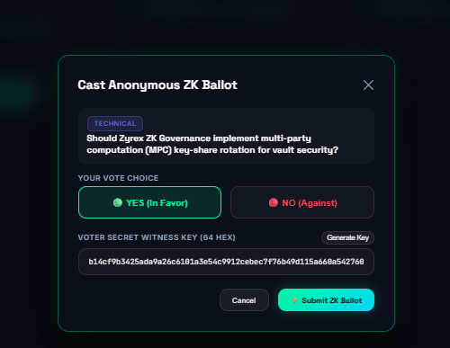
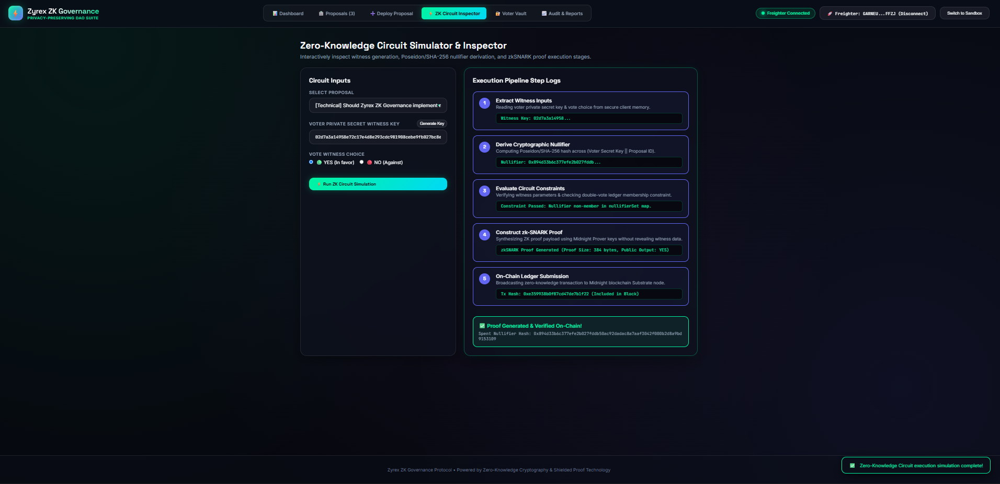
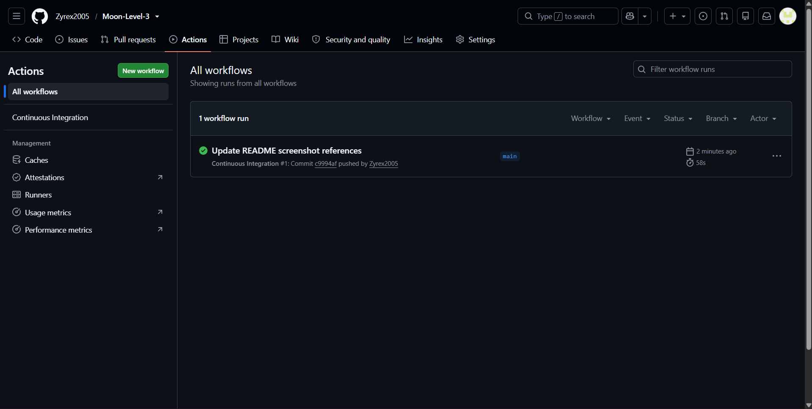

# Zyrex ZK Governance - ZK Private Voting Suite

[](https://github.com/Zyrex2005/Moon-Level-3/actions/workflows/ci.yml)

The video demonstration below shows the full functionality in action: proposal creation, random voter key generation, anonymous voting transitions, proof generation loading states, and administrative closure.
### Private Voting Walkthrough Demo Video
https://drive.google.com/file/d/1CpH8jidSIEwDShY54i9qhXQlUUPcHt8b/view?usp=sharing

### Live Deploy
https://moon-level3.vercel.app/

An upgraded, production-grade, zero-knowledge privacy-preserving decentralized application (dApp) built on zero-knowledge cryptography. This platform empowers eligible voters to cast anonymous YES/NO ballots on proposals across multiple categories (Governance, Grants, Technical, Community). Votes are verifiably tabulated on-chain via zkSNARK circuits without revealing the voter's address or choice mapping.

---

## Key Upgrades & New Features

1. **Futuristic Cyber Emerald Glassmorphic UI/UX**:
   - Modern dark design system powered by custom CSS tokens, Space Grotesk & Inter typography, glowing cyber emerald accents, and smooth micro-animations.
   - Multi-tab executive navigation bar: **Dashboard**, **Explore Proposals**, **Deploy Proposal**, **ZK Circuit Inspector**, **Voter Vault**, and **Audit & Reports**.
2. **Proposal Categories & Categorized Filtering**:
   - Sort and search proposals by category (`Governance`, `Grants`, `Technical`, `Community`), keyword search, and status (`Active` / `Closed`).
   - Dynamic vote percentage distribution bars and real-time nullifier count tracking.
3. **Interactive ZK Circuit Simulator & Inspector**:
   - Live step-by-step cryptographic execution visualizer tracing Witness Input Extraction → Cryptographic Nullifier Derivation → Double-Vote Membership Guard Evaluation → zkSNARK Proof Synthesis → On-Chain Ledger Submission.
4. **Client-Side Voter Vault & Nullifier Status Validator**:
   - Secure 256-bit entropy secret key generator with one-click clipboard copy.
   - On-chain nullifier status checker to verify whether a key has already voted on a proposal without revealing its choice.
5. **Data Export & Audit Reports**:
   - Download complete governance state records as formatted JSON or CSV audit spreadsheets.

---

## Deployed Smart Contract Details

The smart contract for the Private Voting dApp is deployed and active on the **Midnight Preprod Testnet**.

| Property | Value / Details |
| :--- | :--- |
| **Network** | **Midnight Preprod Testnet** |
| **Contract Name** | `voting.compact` |
| **Deployed Contract Address** | `02008a62a84fd09e1c4b7a3e9f2d1c5a8b7e6d5f4c3b2a1e0f9d8c7b6a5f4e3d` |
| **Contract State Identifier** | `votingPrivateState` |
| **Substrate Node RPC** | `https://rpc.testnet.midnight.network` |
| **Indexer Endpoint** | `https://indexer.testnet.midnight.network/api/v1/graphql` |
| **Prover Server URI** | `https://prover.testnet.midnight.network` |
| **Supported Wallet** | Lace Wallet Extension (Midnight Devnet / Preprod) |

---

## Privacy Model & ZK Nullifier Security

### What an Observer CAN Learn (On-Chain Public Data)
- **Aggregated Vote Tallies**: The total number of `YES` and `NO` votes accumulated on a proposal.
- **Nullifier Set Commitments**: The set of unique 256-bit nullifiers (`SHA-256(voterSecretKey || proposalId)`) recorded on-chain to prevent double voting.
- **Proposal Metadata & Status**: Proposal ID, proposal description text, category, creation time, expiration time, and whether voting is open or closed.

### What an Observer CANNOT Learn (Client-Side Shielded Data)
- **Voter Public Identity / Wallet Address**: The observer cannot determine which user or wallet address cast a specific vote.
- **Individual Vote Choice**: The observer cannot determine whether a specific voter voted `YES` or `NO`.
- **Voter Secret Key**: The private witness key (`voterSecretKey`) remains exclusively within the user's local client memory and is never transmitted or exposed on-chain.
- **Vote-to-Nullifier Mapping**: An observer cannot link a public nullifier to any specific wallet identity or voter secret key.

---

## Screenshot

**Wallet Connected**


**Create Proposal**


**Vote Predict**


**Simulation**


**CI Pipeline**



## Testing Guide

Run the Vitest test suite to verify circuit constraints and API helper utilities:

```bash
# Run unit tests
npm test

# Production TypeScript & Vite build
npm run build
```

---

## Running the Application Locally

```bash
# Install dependencies
npm install

# Start development server
npm run dev
```

Visit `http://localhost:5173` in your browser.
